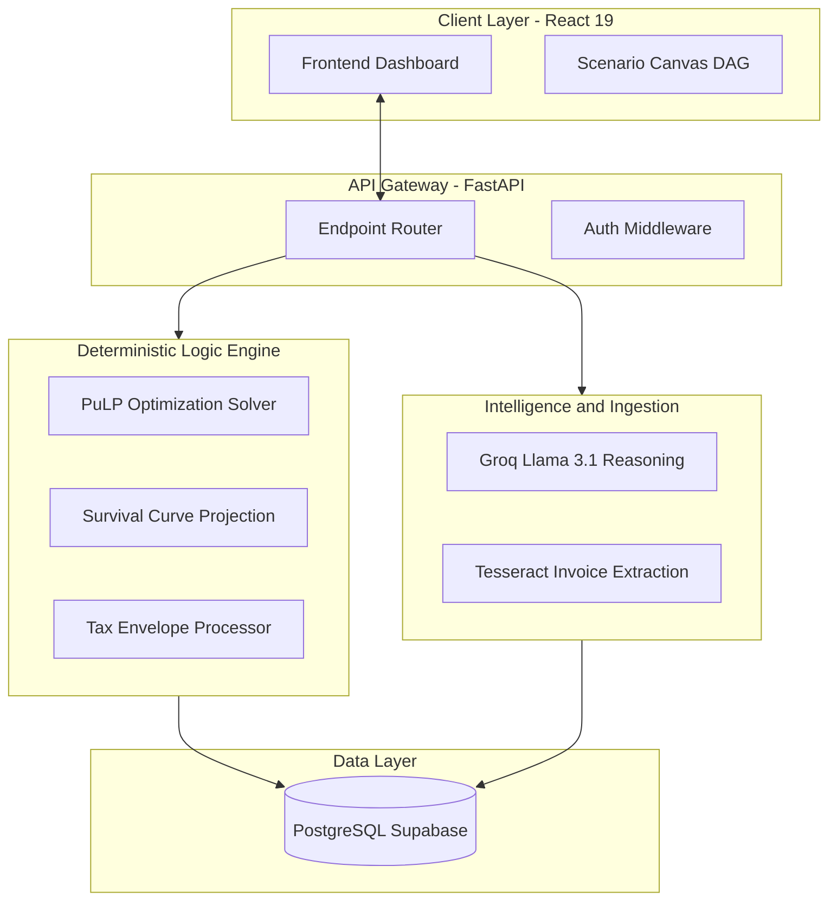

# FlowIQ: Deterministic Financial Decision Engine

[](./LICENSE)


FlowIQ is a high-performance financial operating system designed for founders and finance teams to manage liquidity with mathematical precision. By combining Mixed-Integer Linear Programming (MILP) for optimization with Large Language Model (LLM) heuristics for automated vendor negotiation, FlowIQ transforms static ledger data into dynamic, actionable cash strategies.

---

## Core Features

### Deterministic Optimization Engine
The core engine models cashflow management as a constrained optimization problem using **Mixed-Integer Linear Programming (MILP)** via the PuLP library and CBC solver.
- **Objective Function**: Minimizes the weighted cumulative cost of payment delays, where weights are derived from vendor relationship risk and penalty rates.
- **Constraints**: Enforces a hard liquidity ceiling (available cash + expected receivables) and boundary enclosures for each financial item.
- **Action Directives**: Outputs a discrete set of instructions (Pay, Partial, Negotiate, Delay) based on the optimal solver state.

### Scenario Canvas (DAG Architecture)
Interactive financial modeling layer built on a **Directed Acyclic Graph (DAG)** topology using `@xyflow/react`.
- **Node Topology**: Represents financial entities (Revenue Nodes, Payable Nodes, Cash Nodes) with internal state.
- **Edge Allocations**: Directed edges represent explicit cash flows. Connecting a revenue node to a payable node performs an "allocation" which the engine uses to recalculate runway survival curves in real-time.
- **Asynchronous Simulation**: Changes to the graph topology trigger immediate recalculations of the financial projection state without full-page reloads.

### AI-Driven Ingestion & Negotiation
A multi-modal intelligence layer for data extraction and communication synthesis.
- **OCR Pipeline**: Utilizes Tesseract for high-accuracy field extraction from PDF/image invoices, mapping raw text to structured Pydantic schemas.
- **Negotiation Engine**: Employs Llama 3.1/3.2 (via Groq) to generate context-aware vendor correspondence. The engine uses relationship tiers and optimization "Reduced Costs" to argue for specific deferment terms.

### Liquidity & Runway Analytics
- **Survival Curve Projections**: Derived using Pandas-based series analysis to project cash depletion over time.
- **Failure Mode Identification**: Automated detection of "Liquidity Gaps"—points in time where cumulative obligations exceed the projected cash ceiling.

---

## Technical Architecture

The system follows a decoupled architecture separating deterministic computation from state management and presentation.

1. **Ingestion**: Raw financial data enters via OCR or manual input and is persisted in PostgreSQL.
2. **Contextualization**: The system calculates the "Tax Envelope" and "Available Operational Cash" to set the optimization boundaries.
3. **Optimization**: The MILP solver processes the ledger to find the global minimum for delay costs.
4. **Presentation**: The React layer renders the dashboard and interactive canvas, allowing users to override the deterministic engine with manual DAG overrides.

---

## Tech Stack

| Layer | Technologies |
| :--- | :--- |
| **Frontend** | React 19, TypeScript 6, Vite 8, Tailwind CSS 4, Recharts, xyflow/react |
| **Backend** | FastAPI (ASGI), SQLAlchemy 2.0, Pydantic v2, Pandas |
| **Database** | PostgreSQL (via Supabase) |
| **Optimization** | PuLP, CBC Solver |
| **AI / ML** | Groq (Llama 3.1 70B / 3.2 Vision), Tesseract OCR, Sentence-Transformers |
| **DevOps** | Alembic (Migrations), Pytest |

---

## High-Level Design



---

## Project Structure

```text
FlowIQ/
├── backend/                  # FastAPI ASGI Application
│   ├── app/
│   │   ├── api/              # API Endpoint Definitions
│   │   │   └── routes/       # Domain-specific logic: engine, ingestion, audit
│   │   ├── core/             # Global Configuration & Pydantic settings
│   │   ├── db/               # SQLAlchemy Session and Engine Logic
│   │   ├── models/           # SQLAlchemy Declarative Domain Objects
│   │   ├── schemas/          # Pydantic Request/Response validation
│   │   ├── services/         # Core Logic: PuLP solver, OCR ingestion, runway projection
│   │   └── main.py           # Application Entry Point
│   ├── alembic/              # SQL / Transactional Migrations
│   ├── tests/                # Coverage for solver logic and API integration
│   ├── requirements.txt      # Dependency Specification
│   └── .env.example          # Backend variable template
├── frontend/                 # React 19 + TypeScript + Vite 8
│   ├── src/
│   │   ├── components/       # Primitive UI Library
│   │   ├── hooks/            # Logic decoupling: useFinancialState, useData
│   │   ├── pages/            # View Layer: ActionCenter, ScenarioCanvas, Audit
│   │   ├── services/         # Centralized API Integration (Axios)
│   │   ├── types/            # TypeScript Interface Schema
│   │   └── App.tsx           # Route Registry
│   ├── vite.config.ts        # Vite 8 Build Configuration
│   └── package.json          # Node Dependency Manifest
├── LICENSE                   # Apache 2.0
└── README.md
```

---

## Explainability Model

The explainability layer parses the solver's `pi` (shadow price) values:
- **Binding Cash Constraint**: Indicates the marginal increase in the objective value per $1 increase in liquidity.
- **Cap Shadow Price**: Indicates the marginal value of increasing the allowable payment cap for a specific item.
- **Reduced Costs ($d_j$)**: Signals the degree of sub-optimality for items deferred by the solver.

---

## Setup Guide

### 1. Backend Service
```bash
cd backend
python3 -m venv .venv
source .venv/bin/activate
pip install -r requirements.txt
cp .env.example .env
alembic upgrade head
uvicorn app.main:app --reload
```

### 2. Frontend Interface
```bash
cd frontend
npm install
cp .env.example .env
npm run dev
```

---

## Testing & Validation

Execute the full suite of deterministic engine tests and integration benchmarks:
```bash
pytest -v backend/tests
```
